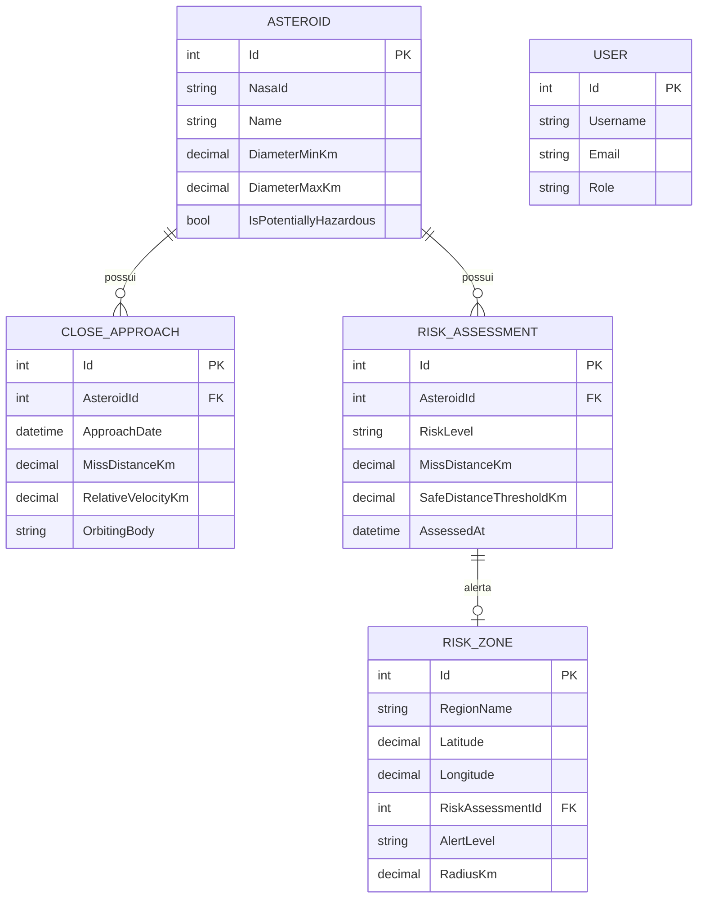
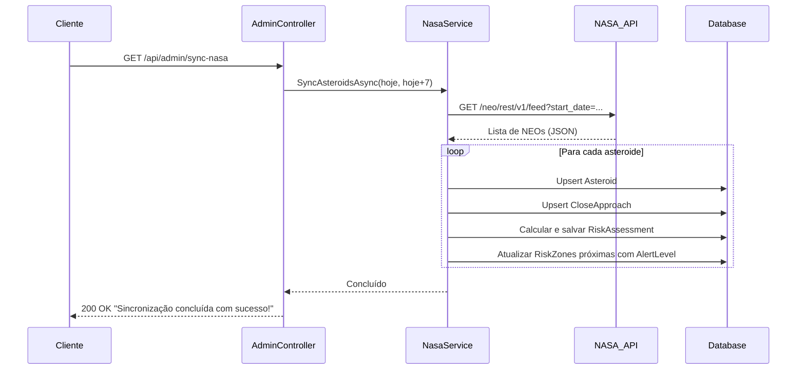
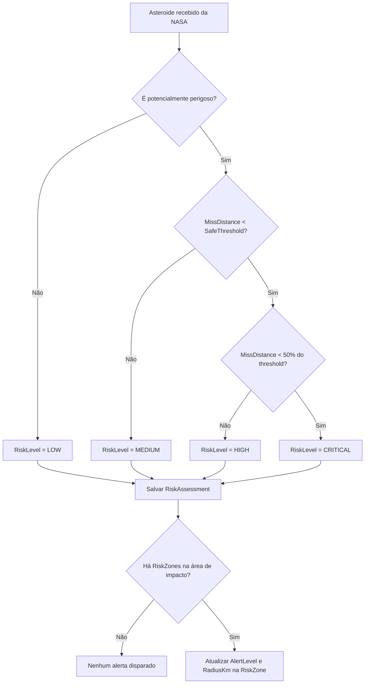

# 🌌 NEI — Near Earth Impact

> Sistema de monitoramento de asteroides próximos da Terra com integração à API da NASA, avaliação automática de riscos e gerenciamento de zonas de alerta geográficas.

---

## 📋 Sumário

- [Sobre o Projeto](#sobre-o-projeto)
- [Tecnologias](#tecnologias)
- [Arquitetura](#arquitetura)
- [Diagrama de Entidades](#diagrama-de-entidades)
- [Fluxo de Sincronização com a NASA](#fluxo-de-sincronização-com-a-nasa)
- [Como Executar](#como-executar)
- [Endpoints da API](#endpoints-da-api)
- [Exemplos de Requisição](#exemplos-de-requisição)
- [Testes](#testes)

---

## Sobre o Projeto

O **NEI (Near Earth Intelligence)** é uma API REST desenvolvida em **ASP.NET Core** que consome a [NASA NeoWs API](https://api.nasa.gov/) para rastrear objetos próximos da Terra (NEOs — *Near-Earth Objects*). O sistema classifica automaticamente o nível de risco de cada asteroide e associa alertas às zonas geográficas cadastradas, permitindo que operadores monitorem ameaças em tempo real.

### Funcionalidades principais

- Sincronização automática e manual com a API da NASA
- Classificação de risco em 4 níveis: `LOW`, `MEDIUM`, `HIGH` e `CRITICAL`
- Gerenciamento de zonas geográficas de risco com alertas dinâmicos
- API RESTful documentada via Swagger/OpenAPI
- Banco de dados Oracle com Entity Framework Core

---

## Tecnologias

| Camada | Tecnologia |
|---|---|
| Framework | ASP.NET Core 8 |
| ORM | Entity Framework Core |
| Banco de Dados | Oracle Database |
| Documentação | Swagger / Swashbuckle |
| Integração Externa | NASA NeoWs REST API |
| Linguagem | C# 12 |

---

## Arquitetura

O projeto segue uma arquitetura em camadas simples, separando responsabilidades entre Controllers, Services e Data.

```
NEI/
├── Controllers/
│   ├── AdminController.cs          # Sync NASA + Reset
│   ├── AsteroidController.cs       # CRUD de asteroides
│   ├── CloseApproachController.cs  # CRUD de aproximações
│   ├── RiskAssessmentController.cs # CRUD de avaliações de risco
│   ├── RiskZoneController.cs       # CRUD de zonas de risco
│   └── UserController.cs           # CRUD de usuários
├── DTOs/
│   ├── CloseApproachRequest.cs
│   ├── NasaFeedResponse.cs
│   ├── RiskAssessmentRequest.cs
│   ├── RiskZoneRequest.cs
│   └── UserRequest.cs   
├── Data/
│   └── AppDbContext.cs             # Contexto EF Core / Oracle
├── Migrations/
├── Models/
│   ├── Asteroid.cs
│   ├── CloseApproach.cs
│   ├── RiskAssessment.cs
│   ├── RiskZone.cs
│   └── User.cs
├── Services/
│   ├── CloseApproachService.cs
│   ├── NasaIntegrationService.cs   # Integração com a API da NASA
│   └── RiskAssessmentService.cs
├── enums/
│   ├── AlertLevel.cs
│   ├── RiskLevel.cs
│   ├── Role.cs 
└── Program.cs
```

---

## Diagrama de Entidades



---

## Fluxo de Sincronização com a NASA

O fluxo abaixo descreve o que ocorre ao chamar `GET /api/admin/sync-nasa`:



---

## Fluxo de Avaliação de Risco



---
## Link do vídeo de demontração: https://youtu.be/mG-9_zXv1gM
---

## Como Executar
 
### Pré-requisitos
 
- [.NET 8 SDK](https://dotnet.microsoft.com/download)
- Oracle Database (local ou em nuvem)
- Chave de API da NASA — obtenha gratuitamente em [api.nasa.gov](https://api.nasa.gov/)
---
 
## 🔵 Setup com Visual Studio 2022
 
### 1. Clonar o repositório
 
**Opção A — Via Git dentro do Visual Studio:**
1. Abra o **Visual Studio**
2. Clique em **File** → **Clone a Repository...**
3. Cole a URL: `https://github.com/GlobalSolution-Fiap-2TDSPX-2026/DotNetNEI.git`
4. Escolha a pasta local e clique em **Clone**

**Opção B — Pelo terminal (PowerShell):**
```powershell
git clone https://github.com/GlobalSolution-Fiap-2TDSPX-2026/DotNetNEI.git
cd DotNetNEI
```
 
### 2. Abrir o projeto
 
1. Abra o **Visual Studio**
2. Clique em **File** → **Open** → **Project/Solution**
3. Navegue até a pasta `DotNetNEI` e selecione o arquivo `DotNetNEI.sln`
4. Clique em **Open**
O VS carregará a solução e exibirá o projeto no **Solution Explorer**.
 
### 3. Configurar o `appsettings.json`
 
1. No **Solution Explorer** (painel esquerdo), localize o arquivo `appsettings.json.example` na raiz do projeto
2. Renomeie para `appsettings.json`
3. Atualize com suas credenciais:
```json
{
  "ConnectionStrings": {
    "OracleDb": "User Id=SEU_USUARIO;Password=SUA_SENHA;Data Source=SEU_HOST:1521/SEU_SERVICE"
  },
  "Nasa": {
    "ApiKey": "SUA_CHAVE_NASA",
    "BaseUrl": "https://api.nasa.gov/neo/rest/v1"
  }
}
```
 
4. Salve com **Ctrl+S**
### 4. Restaurar pacotes NuGet
 
O Visual Studio restaura automaticamente os pacotes ao abrir a solução, mas você pode forçar manualmente:
 
**Opção A — Via Package Manager Console:**
1. **Tools** → **NuGet Package Manager** → **Package Manager Console**
2. Execute no terminal:
```powershell
Update-Package
```
 
**Opção B — Via GUI:**
1. **Tools** → **NuGet Package Manager** → **Manage NuGet Packages for Solution**
2. Clique em **Restore** se houver pacotes faltando
### 5. Aplicar as migrations do banco de dados
 
**Via Package Manager Console (recomendado):**
 
1. **Tools** → **NuGet Package Manager** → **Package Manager Console**
2. Certifique-se de que o projeto padrão é **DotNetNEI** (dropdown no topo da janela)
3. Execute:
```powershell
Update-Database
```
 
**Via CLI (PowerShell/CMD):**
```powershell
dotnet ef database update
```
 
### 6. Executar a aplicação
 
**Opção A — Pressione F5 ou Ctrl+F5**
- **F5**: Executa com debugger ativo (mais lento, mas permite breakpoints)
- **Ctrl+F5**: Executa sem debugger (mais rápido)
**Opção B — Clique no botão Play**
Procure o botão verde **Play** (▶) na toolbar principal com o nome do projeto ao lado. Clique para iniciar.
 
**Opção C — Menu Debug**
1. **Debug** → **Start Debugging** (F5)
2. Ou **Debug** → **Start Without Debugging** (Ctrl+F5)
A aplicação abrirá no navegador padrão em `https://localhost:7000`.
 
### 7. Acessar a documentação da API
 
Com a aplicação rodando, acesse no navegador:
```
https://localhost:7000/swagger
```
 
O Swagger UI permitirá testar todos os endpoints diretamente.
 
### Dicas do Visual Studio
 
| Atalho | Ação |
|---|---|
| **F5** | Iniciar com debugger |
| **Ctrl+F5** | Iniciar sem debugger |
| **Ctrl+Shift+B** | Build da solução |
| **Ctrl+K, Ctrl+C** | Comentar linha/seleção |
| **Ctrl+K, Ctrl+U** | Descomentar linha/seleção |
| **F10** | Step over (debugger) |
| **F11** | Step into (debugger) |
| **Ctrl+Alt+W, 1** | Abrir janela Watch (debugger) |
 
---
 
## 💻 Setup com VS Code (CLI)
 
### 1. Clonar o repositório
 
```bash
git clone https://github.com/GlobalSolution-Fiap-2TDSPX-2026/DotNetNEI.git
cd DotNetNEI
```
 
### 2. Abrir no VS Code
 
```bash
code .
```
 
### 3. Configurar o `appsettings.json`
 
Abra o arquivo na raiz do projeto (`Ctrl+P` → `appsettings.json.example`) renomeie para `appsettings.json` e atualize:
 
```json
{
  "ConnectionStrings": {
    "OracleDb": "User Id=SEU_USUARIO;Password=SUA_SENHA;Data Source=SEU_HOST:1521/SEU_SERVICE"
  },
  "Nasa": {
    "ApiKey": "SUA_CHAVE_NASA",
    "BaseUrl": "https://api.nasa.gov/neo/rest/v1"
  }
}
```
 
### 4. Aplicar as migrations
 
Abra um terminal no VS Code (`Ctrl+'` ou **View** → **Terminal**) e execute:
 
```bash
dotnet ef database update
```
 
### 5. Executar a aplicação
 
```bash
dotnet run
```
 
A API estará disponível em `https://localhost:7000` e o Swagger em `https://localhost:7000/swagger`.
 
### Extensões recomendadas para VS Code
 
- **C# Dev Kit** — suporte completo para C#
- **REST Client** — testar endpoints diretamente no editor
- **Thunder Client** — cliente HTTP integrado
- **SQLTools** — gerenciar conexões com Oracle
- **Entity Framework Core Power Tools** — visualizar diagrama de entidades
---
 
## Endpoints da API
 
### 🔧 Admin
 
| Método | Rota | Descrição |
|---|---|---|
| `GET` | `/api/admin/sync-nasa` | Força sincronização com a NASA (próximos 7 dias) |
| `DELETE` | `/api/admin/reset` | Remove todos os asteroides e limpa alertas das zonas |
 
### 🪨 Asteroids
 
| Método | Rota | Descrição |
|---|---|---|
| `GET` | `/api/asteroid` | Lista todos os asteroides |
| `GET` | `/api/asteroid/{id}` | Busca asteroide por ID |
| `GET` | `/api/asteroid/search?name=` | Busca asteroides pelo nome |
 
### 🛸 Close Approaches
 
| Método | Rota | Descrição |
|---|---|---|
| `GET` | `/api/closeapproach` | Lista todas as aproximações |
| `GET` | `/api/closeapproach/{id}` | Busca aproximação por ID |
| `POST` | `/api/closeapproach` | Cria nova aproximação |
| `PUT` | `/api/closeapproach/{id}` | Atualiza aproximação |
| `DELETE` | `/api/closeapproach/{id}` | Remove aproximação |
 
### ⚠️ Risk Assessments
 
| Método | Rota | Descrição |
|---|---|---|
| `GET` | `/api/riskassessment` | Lista todas as avaliações de risco |
| `GET` | `/api/riskassessment/{id}` | Busca avaliação por ID |
| `POST` | `/api/riskassessment` | Cria nova avaliação |
| `PUT` | `/api/riskassessment/{id}` | Atualiza avaliação |
| `DELETE` | `/api/riskassessment/{id}` | Remove avaliação |
 
### 🗺️ Risk Zones
 
| Método | Rota | Descrição |
|---|---|---|
| `GET` | `/api/riskzone` | Lista todas as zonas de risco |
| `GET` | `/api/riskzone/{id}` | Busca zona por ID |
| `POST` | `/api/riskzone` | Cadastra nova zona |
| `PUT` | `/api/riskzone/{id}` | Atualiza zona |
| `DELETE` | `/api/riskzone/{id}` | Remove zona |
 
### 👤 Users
 
| Método | Rota | Descrição |
|---|---|---|
| `GET` | `/api/user` | Lista todos os usuários |
| `GET` | `/api/user/{id}` | Busca usuário por ID |
| `POST` | `/api/user` | Cria novo usuário |
| `PUT` | `/api/user/{id}` | Atualiza usuário |
| `DELETE` | `/api/user/{id}` | Remove usuário |
 
---

## Exemplos de Requisição

### Sincronizar dados com a NASA

```http
GET /api/admin/sync-nasa
```

**Resposta 200:**
```
Sincronização com a NASA concluída com sucesso!
```

---

### Listar asteroides

```http
GET /api/asteroid
```

**Resposta 200:**
```json
[
  {
    "id": 1,
    "nasaId": "2021277",
    "name": "21277 (1996 TO5)",
    "diameterMinKm": 0.34,
    "diameterMaxKm": 0.76,
    "isPotentiallyHazardous": true
  }
]
```

---

### Buscar asteroide por nome

```http
GET /api/asteroid/search?name=Apophis
```

**Resposta 200:**
```json
[
  {
    "id": 3,
    "nasaId": "2099942",
    "name": "99942 Apophis (2004 MN4)",
    "diameterMinKm": 0.31,
    "diameterMaxKm": 0.69,
    "isPotentiallyHazardous": true
  }
]
```

---

### Cadastrar zona de risco

```http
POST /api/riskzone
Content-Type: application/json

{
  "regionName": "São Paulo",
  "latitude": -23.55,
  "longitude": -46.63
}
```

**Resposta 201:**
```json
{
  "id": 1,
  "regionName": "São Paulo",
  "latitude": -23.55,
  "longitude": -46.63,
  "alertLevel": null,
  "radiusKm": null,
  "riskAssessmentId": null
}
```

---

### Criar avaliação de risco

```http
POST /api/riskassessment
Content-Type: application/json

{
  "asteroidId": 1,
  "riskLevel": "HIGH",
  "missDistanceKm": 3000000.00,
  "safeDistanceThresholdKm": 7500000.00,
  "assessedAt": "2026-07-15T00:00:00"
}
```

**Resposta 201:**
```json
{
  "id": 1,
  "asteroidId": 1,
  "riskLevel": "HIGH",
  "missDistanceKm": 3000000.00,
  "safeDistanceThresholdKm": 7500000.00,
  "assessedAt": "2026-07-15T00:00:00"
}
```

---

### Criar aproximação manualmente

```http
POST /api/closeapproach
Content-Type: application/json

{
  "asteroidId": 1,
  "approachDate": "2026-07-15T00:00:00",
  "missDistanceKm": 500000.00,
  "relativeVelocityKm": 12.5,
  "orbitingBody": "Earth"
}
```

**Resposta 201:**
```json
{
  "id": 1,
  "asteroidId": 1,
  "approachDate": "2026-07-15T00:00:00",
  "missDistanceKm": 500000.00,
  "relativeVelocityKm": 12.5,
  "orbitingBody": "Earth"
}
```

---

### Criar usuário

```http
POST /api/user
Content-Type: application/json

{
  "username": "joao.silva",
  "email": "joao.silva@nei.gov.br",
  "role": "ANALYST"
}
```

**Resposta 201:**
```json
{
  "id": 1,
  "username": "joao.silva",
  "email": "joao.silva@nei.gov.br",
  "role": "ANALYST"
}
```

---

### Reset completo do sistema

```http
DELETE /api/admin/reset
```

**Resposta:** `204 No Content`

> ⚠️ **Atenção:** Esta operação é irreversível. Remove todos os asteroides (e suas aproximações e avaliações em cascata) e zera os alertas de todas as zonas de risco.

---

## Testes

### Ferramentas recomendadas

- **Swagger UI** — disponível em `/swagger` ao rodar a aplicação localmente
- **Postman** — importe a collection abaixo
- **curl** — exemplos nas seções a seguir

---

### Cenário 1 — Fluxo completo de sincronização e leitura

```bash
# 1. Sincronizar com a NASA
curl -X GET https://localhost:7000/api/admin/sync-nasa

# 2. Verificar asteroides importados
curl -X GET https://localhost:7000/api/asteroid

# 3. Verificar aproximações geradas
curl -X GET https://localhost:7000/api/closeapproach

# 4. Verificar avaliações de risco geradas
curl -X GET https://localhost:7000/api/riskassessment

# 5. Verificar alertas nas zonas (se houver zonas cadastradas)
curl -X GET https://localhost:7000/api/riskzone
```

---

### Cenário 2 — CRUD de zona de risco

```bash
# Criar zona
curl -X POST https://localhost:7000/api/riskzone \
  -H "Content-Type: application/json" \
  -d '{"regionName":"Rio de Janeiro","latitude":-22.90,"longitude":-43.17}'

# Atualizar zona (substituir {id} pelo ID retornado)
curl -X PUT https://localhost:7000/api/riskzone/{id} \
  -H "Content-Type: application/json" \
  -d '{"regionName":"Grande Rio","latitude":-22.95,"longitude":-43.20}'

# Deletar zona
curl -X DELETE https://localhost:7000/api/riskzone/{id}
```

---

### Cenário 3 — Reset e re-sincronização

```bash
# 1. Resetar dados
curl -X DELETE https://localhost:7000/api/admin/reset

# 2. Confirmar que asteroides foram removidos (deve retornar [])
curl -X GET https://localhost:7000/api/asteroid

# 3. Confirmar que alertas das zonas foram zerados
curl -X GET https://localhost:7000/api/riskzone

# 4. Re-sincronizar
curl -X GET https://localhost:7000/api/admin/sync-nasa
```

---

### Casos de teste — Respostas esperadas

| Cenário | Endpoint | Status Esperado |
|---|---|---|
| Listar asteroides sem dados | `GET /api/asteroid` | `200 []` |
| Buscar asteroide inexistente | `GET /api/asteroid/9999` | `404 Not Found` |
| Buscar por nome sem resultado | `GET /api/asteroid/search?name=XYZ` | `200 []` |
| Criar zona com dados válidos | `POST /api/riskzone` | `201 Created` |
| Criar zona com dados inválidos | `POST /api/riskzone` (body vazio) | `400 Bad Request` |
| Atualizar zona inexistente | `PUT /api/riskzone/9999` | `404 Not Found` |
| Deletar zona inexistente | `DELETE /api/riskzone/9999` | `404 Not Found` |
| Sync NASA bem-sucedido | `GET /api/admin/sync-nasa` | `200 OK` |
| Reset completo | `DELETE /api/admin/reset` | `204 No Content` |

---

### Acessando o Swagger

Com a aplicação rodando, acesse:

```
https://localhost:7000/swagger
```

O Swagger permite testar todos os endpoints diretamente pelo navegador, com exemplos de payload e documentação dos parâmetros e respostas.

---

## Níveis de Risco

| Nível | Descrição |
|---|---|
| `LOW` | Asteroide não classificado como perigoso |
| `MEDIUM` | Potencialmente perigoso, mas fora do raio de ameaça |
| `HIGH` | Distância de passagem abaixo do threshold seguro |
| `CRITICAL` | Distância de passagem abaixo de 50% do threshold seguro |
